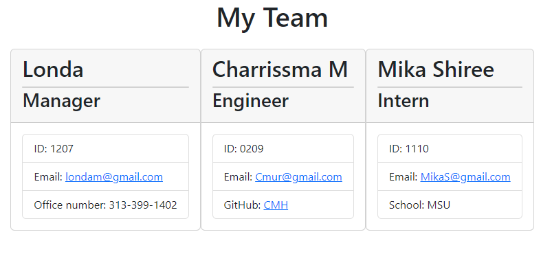

# Team-Londa-Profile-Gen

## Action Needed
Creat a Node.js command-line application that takes in information about employees on a software engineering team and generates an HTML webpage that displays summaries for each person. 

## Actions Taken
* Used Inquirer package to prompt the user with a series of questions (employee, emp ID, contact info, etc.) via the command-line interface. 
* Used the Jest package for running unit tests. 
* Used the "writefile" function to write the inputs onto a generated HTML. 
* Used bootstrap for basic styling, boxes/cards, web display.  
 
## Screen Shot

 

## Links
Video Link:
https://drive.google.com/file/d/11NztmVe1EyoVV1_BbqrmE516siWOs0Ml/view

GitHub Link:
https://github.com/LondaNH/Team-Londa-Profile-Gen

